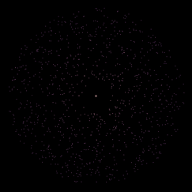
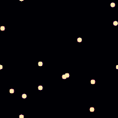
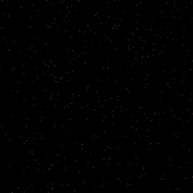

# Simulation Zoo

> A small collection of deterministic simulations, each with one signature visual.

Every exhibit is a self-contained slice of physics — a particle system, a scalar
field, a flock — paired with a renderer that makes it fun to watch. The code
underneath is fixed-timestep, seeded, and reproducible: the same run always
produces the same frames.

This is a zoo, not an engine. The whole point is that adding a new animal is a
small, boring, well-documented task.

## Gallery

| Exhibit | Family | What it is |
|---|---|---|
| **N-body galaxy** | particle | <br>A self-gravitating disk around a central mass, integrated with leapfrog. Speed-coloured trails. |
| **Gray-Scott** | field | <br>Reaction-diffusion: two chemicals on a grid producing organic coral. |
| **Boids** | agent | <br>Reynolds flocking — separation, alignment, cohesion — on a torus. |

The GIFs are generated from the repository, not hand-captured. See
[`tools/run_all.py`](tools/run_all.py).

## Quick start

```sh
cmake -S . -B build -DCMAKE_BUILD_TYPE=Release
cmake --build build -j
./build/zoo list
./build/zoo run nbody --frames 300 --out out/nbody
```

Then turn the frames into a GIF:

```sh
python3 tools/make_gif.py out/nbody gallery/nbody.gif --fps 20
# or rebuild every gallery GIF at once:
python3 tools/run_all.py
```

## Commands

```
zoo list                                   list exhibits
zoo params <exhibit>                       show an exhibit's tunable parameters
zoo run <exhibit> [options]                render frames to PPM files
```

`run` options:

| Option | Meaning | Default |
|---|---|---|
| `--seed N` | deterministic seed | `1` |
| `--frames N` | number of frames | `300` |
| `--fps N` | step size is `1/fps` seconds | `60` |
| `--width W`, `--height H` | image size in pixels | `640` |
| `--exposure F` | tone-map exposure (additive exhibits) | from params |
| `--out DIR` | output directory | `out/<exhibit>` |
| `--param k=v` | override an exhibit parameter (repeatable) | — |

Example — a bigger, different galaxy:

```sh
./build/zoo run nbody --seed 42 --frames 600 --param particles=4000 --param trail=0.95
```

## Requirements

- A C++17 compiler (GCC, Clang, or MSVC) and CMake ≥ 3.16.
- Python 3 with Pillow for the GIF tooling (only needed to build the gallery).

The core builds and renders on Linux, macOS, and Windows.

## The rules

1. **Deterministic.** Same seed + parameters ⇒ same frames, always.
2. **Boring to extend.** An exhibit is one file implementing one small
   interface. The runner never changes.
3. **Cool first, serious underneath.** If it isn't fun to watch, it doesn't go
   in. If it isn't honest physics, it doesn't either.

## Documentation

| Document | Read it for |
|---|---|
| [`DESIGN.md`](DESIGN.md) | how the system is put together and why |
| [`EXHIBIT.md`](EXHIBIT.md) | how to add a new exhibit (the recipe) |
| [`TRUST.md`](TRUST.md) | the reproducibility contract and how to verify it |
| [`PLAN.md`](PLAN.md) | roadmap: live viewer, sandbox, effects, web |

## License

MIT.
